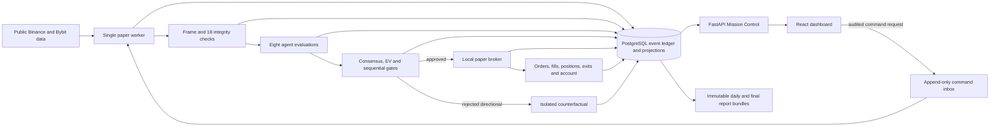

# Architecture

## Overview

MAAIS is a single-operator, local quantitative-research and paper-trading
workstation. It consumes public market data, creates one auditable decision per
symbol per closed one-minute bar, simulates execution locally, and records the
complete causal trail in PostgreSQL. It has no live-money runtime mode.

The official candidate uses ten USDT perpetual symbols, 10,000 USDT virtual
capital, one-way positions, 1x leverage, and a frozen fee/filter/fill policy.

## Runtime topology

| Component | Ownership and permissions |
|---|---|
| Paper worker | Owns public-data ingestion, frame construction, decisions, paper execution, account state, exits, recovery, incidents, and official database mutations. |
| Mission Control | FastAPI serves read-only queries, WebSocket events, the built React UI, and authenticated command enqueueing. It cannot directly mutate official positions, orders, fills, or account projections. |
| Daily-close supervisor | Runs the concurrency-locked Berlin-day report and backup workflow and records immutable bundle identities in local run state. |
| Sleep inhibitor | Uses `caffeinate` on macOS or `systemd-inhibit` on Linux so a timed run does not silently pause with the machine. |
| PostgreSQL 16 | Authoritative event ledger, projections, controls, incidents, and experiment identity. Docker Compose manages this service only. |
| DuckDB/Parquet | Local feature/replay storage and analysis-ready report exports; never the official account source of truth. |

The four host processes run in named `tmux` sessions. The purpose-bound start
scripts record their exact PIDs, session names, Docker context, PostgreSQL
`system_identifier`, manifest, and evidence paths in
`artifacts/run-state/current.json`.

## Decision and execution flow

1. Public connectors ingest futures bars/books/marks/funding plus primary-spot
   and secondary-venue references with venue and observed timestamps preserved.
2. The frame builder admits only causal observations at or before the closed-bar
   cutoff and records source identifiers, sequences, snapshots, and hashes.
3. Eighteen integrity evaluations check chronology, gaps, duplicates, lag,
   prices, book state, source coverage, cross-market basis, and warm-up state.
4. The feature pipeline and all eight configured agents produce versioned input
   snapshots, directions, probability/confidence/risk, reason codes, explanations,
   maturity labels, compatibility, weights, and durations.
5. Consensus, adversarial challenge, expected value after costs, benchmark alpha,
   monitoring, and risk gates run sequentially. The first failing gate and its
   inputs/outputs are persisted.
6. An approved directional proposal receives quantity, notional, stop-risk,
   entry/exit policy, fee, filter, and capability evidence.
7. The paper broker applies latency eligibility, visible-book depth, spread,
   slippage, fees, funding, order-state, FIFO-lot, margin, and exit rules.
8. Rejected directional proposals enter a separate counterfactual projection
   that cannot construct or mutate the official account repository.
9. Projections, domain events, and outbox rows commit in one PostgreSQL unit of
   work. Changed-content retries and stale versions fail closed.

The first 60 closed one-minute bars per symbol are a deliberate warm-up. Those
cycles are still fully persisted as quarantined/neutral decisions.

## Control flow

Mission Control binds to `127.0.0.1`. Read endpoints use PostgreSQL read-only
transactions. A control request requires the local bearer token stored in a
mode-`0600` ignored file and an idempotency key; safety-critical requests also
require the exact confirmation phrase. The API appends the request, and the
worker validates and executes it at a safe point.

Supported command types are start, pause, resume, stop, emergency halt, flatten,
incident acknowledgement/resolution, and kill-switch reset. Every requested,
accepted, completed, or rejected transition remains visible in the audit ledger.

## Persistence and consistency

PostgreSQL stores an append-only event stream beside read projections. The
ledger verifier checks event/projection and account consistency. Immutable
content hashes bind frames, decisions, manifests, commands, reports, and
evidence bundles. Optimistic versions and unique decision/order/event keys make
retry behavior explicit.

See `DATABASE_SCHEMA.md` for the current schema and `API_ENDPOINTS.md` for the
Mission Control contract.

## Candidate and recovery boundary

An official run is valid only when its manifest matches one clean Git commit,
lockfile, Alembic revision, agent source hashes, dashboard build, Docker context,
and PostgreSQL cluster identity. Qualification, backup/restore, disposable
process drills, the uninterrupted 24-hour soak, and the seven-day preflight are
independent gates.

Gap recovery blocks new entries while protective exits remain active. A process
restart during the official soak invalidates the soak even if recovery succeeds.
During the seven-day test, recovery is audited and resumes from database cursors,
leases, checkpoints, orders, exits, controls, and counterfactual state.

## Repository map

| Path | Purpose |
|---|---|
| `maais/market_data/` | Public connectors, causal frames, integrity, gaps, and recovery. |
| `maais/feature_pipeline/` | Deterministic market features and regime classification. |
| `maais/agents/` | The eight official agent implementations and evaluation schema. |
| `maais/decision/`, `maais/decisions/` | Consensus, EV/cost logic, gates, and complete decision bundles. |
| `maais/risk/` | Kelly, volatility, correlation, drawdown, portfolio, and sizing gates. |
| `maais/execution/paper/` | Authorization, orders, fills, positions, account, exits, and sensitivity models. |
| `maais/orchestration/` | Runtime composition, worker, protection, recovery, and command execution. |
| `maais/db/` | SQLAlchemy models, repositories, unit of work, event store, and replay verification. |
| `maais/api/`, `dashboard/` | Mission Control API and React operator interface. |
| `maais/operations/`, `scripts/` | Qualification, reports, backup/restore, health, drills, and timed-run lifecycle. |
| `tests/` | Unit, property, integration, replay, fault-injection, API, and operational-script coverage. |

## Known modeling boundary

The first candidate models maintenance margin as 0.5% of gross notional and does
not calculate an exchange liquidation price or claim Binance liquidation parity.
One week can validate operations, causality, traceability, data integrity, and
the frozen paper accounting/execution model. It cannot prove profitability,
statistical edge, or live-exchange behavior.
