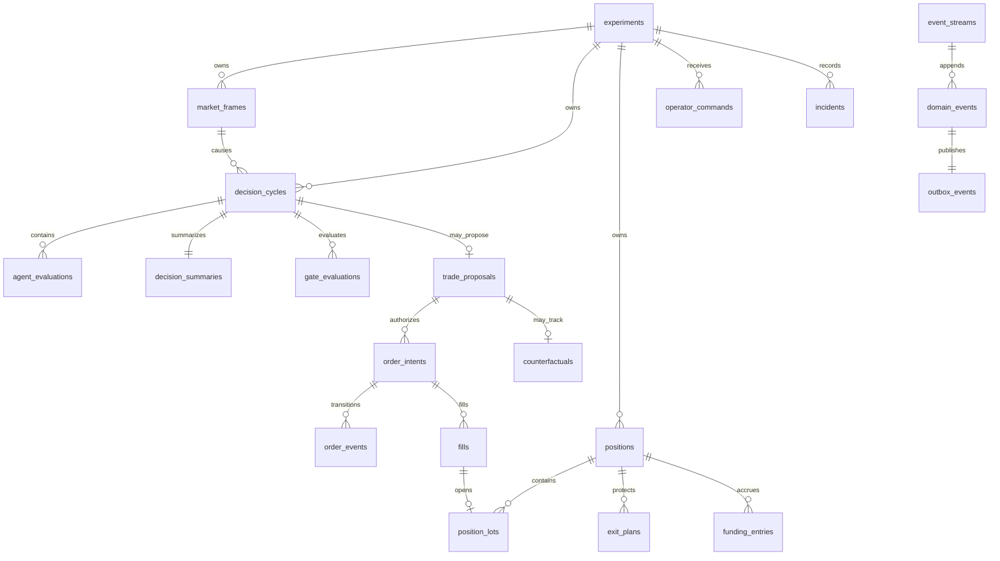

# Database Schema

## Authority and revision

PostgreSQL 16 is the authoritative store for official experiments, decisions,
paper execution, account projections, controls, incidents, and the append-only
event ledger. The current Alembic head is `0017`.

All financial projection values use fixed-precision numeric columns; runtime
domain code uses `Decimal`. Timestamps are timezone-aware UTC. Foreign keys use
`ON DELETE RESTRICT` so audit history cannot be cascaded away.

## Table inventory

### Candidate identity and versions

| Table | Purpose and key constraints |
|---|---|
| `experiments` | Frozen manifest/config/code/lock/schema identity and lifecycle. Manifest hash is unique; modes are limited to replay, paper live, and testnet smoke. |
| `strategy_versions` | Immutable strategy version, stage, implementation hash, and parameters. |
| `agent_versions` | Immutable agent version, maturity, implementation hash, dependencies, parameters, and enabled state. |
| `agent_weights` | Legacy learned-weight projection retained for schema compatibility; not allowed to mutate an official running candidate. |

### Event ledger

| Table | Purpose and key constraints |
|---|---|
| `event_streams` | One optimistic-concurrency stream per aggregate type/ID with current version. |
| `domain_events` | Immutable ordered domain history. Stream version and global position are unique and positive. Database triggers reject update/delete. |
| `outbox_events` | One cursor-ordered publication row per domain event for API/WebSocket catch-up. |

Each projection-changing transaction writes matching domain and outbox events in
the same unit of work. `uv run maais verify-ledger` checks stored event/projection
and account consistency.

### Causal market and decision lineage

| Table | Purpose and key constraints |
|---|---|
| `market_frames` | Closed-bar OHLCV, book/mark/funding/reference snapshots, source manifest/sequences, quality summary, and content hash. One experiment cannot store the same frame content twice. |
| `decision_cycles` | Exactly-once symbol/timeframe/cycle/strategy decision with feature snapshot, status, disposition, direction, first reason, and content hash. |
| `data_quality_evaluations` | One result per integrity check per frame/cycle with required/applicable/passed state, reason, evidence, and timing. |
| `agent_evaluations` | One row per decision and configured agent version: compatibility, weight, direction, probability/confidence/risk, full input, reason codes, explanation, and duration. |
| `decision_summaries` | One consensus/adversarial/EV/cost/benchmark snapshot per decision. |
| `gate_evaluations` | Ordered unique gate chain with inputs, outputs, result, reason, and duration. |
| `trade_proposals` | At most one directional proposal per decision, with status, policies, approved size/notional, and stop risk. |

The official ten-symbol runtime expects one cycle per closed minute per symbol,
eight agent rows and eighteen quality rows per cycle, plus a complete gate chain.
The soak verdict checks those cardinalities directly.

### Paper orders and account

| Table | Purpose and key constraints |
|---|---|
| `order_intents` | Authorized paper command with proposal lineage, client ID, hashes, side/effect/type, quantity, filter snapshot, lifecycle, and optimistic version. Client order ID is unique per experiment. |
| `order_events` | Ordered state transitions for an order, optionally linked to the causal market frame. |
| `fills` | Deterministic paper fill with market event, quantity/price, maker/taker fee, spread, depth, latency, total slippage, and market snapshot. |
| `execution_sensitivities` | Optimistic, conservative, and stress execution outcomes isolated from official P&L. |
| `positions` | Versioned one-way net paper position. A partial unique index permits at most one open position per experiment/symbol; leverage is constrained to 1–5. |
| `position_lots` | FIFO lots linked to opening fills with exact remaining quantity and fee allocation. |
| `exit_plans` | Versioned stop, target, maximum-hold, opposing-signal, and trigger state. A partial unique index permits one active/triggered plan per position. |
| `account_snapshots` | Versioned cash, equity, margin, notional, stop risk, P&L, fees, funding, peak, and drawdown. |
| `funding_entries` | Idempotent funding accrual linked to experiment, position, mark price, rate type, and source market event. |

### Research isolation

| Table | Purpose and key constraints |
|---|---|
| `counterfactuals` | One hypothetical path per rejected directional proposal with rejection gate, causal chain, hypothetical fill/exit, MFE/MAE, horizon outcomes, funding, P&L, and versioned state. |

The counterfactual repository has no account repository dependency, and its
transactions cannot update official orders, fills, positions, lots, exits, or
account snapshots.

### Operations, recovery, and control

| Table | Purpose and key constraints |
|---|---|
| `trading_controls` | Versioned kill-switch state, actor, reason, and timestamps per experiment. |
| `operator_commands` | Idempotent requested/accepted/completed/rejected lifecycle, request hash, confirmation, worker, result, and recovery metadata. |
| `market_cursors` | Per experiment/symbol/stream sequence and event-time progress, halt/recovery state, and optimistic version. |
| `market_recovery_runs` | Gap identity, range, dispatch/progress, before/after hashes, state, and outcome. Only one active recovery is allowed per cursor. |
| `incidents` | Deduplicated warning/critical/review lifecycle with component, reason, evidence, acknowledgement, and resolution. |
| `worker_checkpoints` | Restart-safe worker status, checkpoint time/version, last event position, state hash, and state snapshot. |
| `worker_leases` | Exclusive active worker ownership, heartbeat/expiry/release, and monotonically increasing lease epoch. |

## Main relationships



## Migrations

The linear migration chain is:

| Revision | Scope |
|---|---|
| `0001` | Empty compatibility baseline. |
| `0002`–`0004` | Legacy market/compliance/agent-weight tables. |
| `0005` | Experiments, versions, event streams, domain events, outbox, append-only enforcement. |
| `0006` | Market frames and complete decision lineage. |
| `0007` | Paper orders, fills, positions, exits, account, funding, and sensitivities. |
| `0008` | Counterfactual research projection. |
| `0009` | Operational cursors, quality, recovery, incidents, and checkpoints. |
| `0010`–`0015` | Exit trigger, lease, causal frame, control, funding mark, and counterfactual price hardening. |
| `0016`–`0017` | Audited operator commands and restart recovery metadata. |

Apply and verify:

```bash
export MAAIS_DOCKER_CONTEXT=desktop-linux
docker --context "${MAAIS_DOCKER_CONTEXT}" compose up -d --wait postgres
uv run alembic upgrade head
uv run maais database-identity
uv run maais verify-ledger
```

Never downgrade, truncate, reset, or remove the official local volume to repair a
candidate. Create a verified backup and restore it to a new suffix-constrained
database as described in `docs/runbooks/recovery.md`.

## Capacity

A seven-day ten-symbol run produces about 100,800 decision cycles before any
additional order, fill, incident, or counterfactual rows. The current preflight
requires at least 20 GiB free host disk, and operators should retain additional
headroom for the PostgreSQL volume, WAL, immutable daily backups, and exports.
