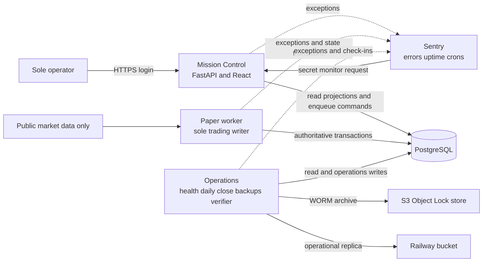

# MAAIS Railway Paper Platform Design

**Status:** Approved architecture; implementation not yet started
**Date:** 2026-08-08
**Owner and operator:** Single user
**Scope:** Railway migration, secure Mission Control, observability, durable evidence,
cloud qualification, and a 24-hour paper-only soak
**Safety boundary:** Public market data and the local paper broker only; no live-money
mode or production-order adapter

## 1. Purpose

This design moves MAAIS from a laptop-dependent paper-trading workstation to a
continuously available Railway deployment without weakening the audit and readiness
guarantees already implemented locally.

The immediate objective is not profitability and is not authorization for a seven-day
run. The objective is a secure, observable, recoverable, paper-only cloud candidate that:

1. preserves every decision, rejection, proposal, order, fill, counterfactual, and
   rationale;
2. fails closed when its authoritative state or inputs become unsafe;
3. exposes Mission Control only to the sole operator;
4. reports errors and health independently of Railway;
5. stores portable, hash-verified, immutable run evidence outside the compute lifecycle;
6. proves recovery behavior in a disposable environment; and
7. passes an uninterrupted 24-hour Railway soak before any separate request to start the
   seven-day paper test.

This document supplements the implemented local baseline in
`2026-08-02-maais-paper-trading-observability-design.md`. It replaces the local `tmux`,
sleep-inhibitor, filesystem run-state, and laptop-continuity assumptions for the cloud
topology. It does not relax the domain, ledger, decision, or paper-only invariants in the
baseline.

## 2. Fixed decisions

- MAAIS remains single-operator and paper-only.
- Supported runtime modes remain `replay`, `paper_live`, and `testnet_smoke`.
- No live-money mode, production exchange adapter, or configuration switch will exist.
- Official paper runs use public market data and the local paper broker.
- `BINANCE_DEMO_API_KEY` and `BINANCE_DEMO_API_SECRET` must be absent from every official
  paper service. Testnet smoke credentials, if ever used, remain isolated and never
  contribute to official P&L.
- PostgreSQL remains authoritative for experiments, decisions, execution, account state,
  controls, incidents, run identity, and evidence catalogs.
- The paper worker remains the only process allowed to mutate trading state.
- Mission Control initially uses a Railway-generated domain. Custom-domain support may be
  added later without changing the authentication boundary.
- The deployment uses a layered topology: Mission Control, paper worker, operations,
  PostgreSQL, and object storage are separate failure domains.
- Railway builds directly from the connected GitHub repository. The paper workflow will
  not request Docker registry credentials or a Docker account.
- Railway autodeployment is disabled for official candidates. Every official deployment
  is deliberate, exact-commit, and evidence-producing.
- Railway restart policy is `NEVER` during the official 24-hour soak. A crash or service
  replacement is evidence of interrupted continuity, not something to hide with an
  automatic restart.
- Sentry supplies off-platform backend and frontend exception tracking, external uptime
  monitoring, scheduled-job monitoring, and email alerts to the sole operator.
- Railway object storage is an operational replica. A versioned WORM-capable object store
  is the canonical immutable archive for official evidence.
- The storage implementation is S3-compatible and provider-neutral. AWS S3 Object Lock is
  the initial recommended WORM target.
- Zero fills is a valid observation. No threshold will be weakened merely to produce
  trades. Decision and rejection metadata must still be complete.
- Passing the 24-hour soak does not start, authorize, or imply readiness to start the
  seven-day run. That action requires a separate explicit instruction.

## 3. Current-state constraints

The approved design responds to concrete limitations in the current implementation:

- the local worker, API, daily supervisor, and sleep inhibitor are supervised by `tmux`;
- official run identity is partly stored in local JSON files and filesystem paths;
- Mission Control binds to local interfaces and its read APIs, exports, command history,
  and WebSocket are not authenticated;
- only command submission uses a local bearer token, which the browser stores in
  `sessionStorage`;
- production logs are JSON but lack a mandatory schema and central redaction policy;
- the terminal worker error is reduced to a truncated message without a traceback;
- health alerts occur only when a CLI health command is invoked with alerting enabled;
- reports and backups are content-hashed but written to local filesystem directories;
- Railway storage buckets do not supply object versioning or Object Lock; and
- the current Railway service is linked to `main`, has no start command, has no variables,
  is not public, and its only deployment failed before an application process started.

The existing failed Railway deployment is preserved as diagnostic evidence. It is not a
candidate and will not be retried until the implementation and qualification gates pass.

## 4. Target topology

### 4.1 Railway environments

Two Railway environments are required:

1. **Qualification**
   - disposable process-drill and fault-injection environment;
   - isolated PostgreSQL database, bucket, credentials, service instances, and Sentry
     environment tag;
   - never contributes to official paper P&L;
   - may intentionally replace services while recording drill evidence.

2. **Production paper**
   - contains the official 24-hour soak and, only after later authorization, the seven-day
     paper experiment;
   - has no automatic deployments, no app sleep, one replica per application service, and
     frozen variables and configuration during a timed run;
   - uses the European Railway region when available so application, database, and bucket
     placement remain close to the operator; the configured Sentry project region is
     recorded rather than assumed.

Environment resources, credentials, object keys, and experiment identities must never be
shared across qualification and production.

### 4.2 Mission Control service

Mission Control is the only application service with a public domain. It:

- serves the built React application and FastAPI API;
- listens on Railway's injected `PORT` and binds on `::`;
- reads projections using a least-privilege web role;
- creates authenticated sessions and appends operator commands through a narrow database
  function or command-inbox permission;
- cannot mutate account, position, order, fill, decision, cursor, lease, or experiment
  projections directly;
- exposes public liveness/readiness responses containing no sensitive state;
- exposes a separate secret-header monitor endpoint for Sentry; and
- attaches no production source maps to publicly served assets.

### 4.3 Paper worker service

The paper worker:

- has no public domain;
- owns public-market ingestion, decision processing, monitoring gates, risk, paper
  execution, counterfactuals, exits, and trading-state persistence;
- is the only service with trading-write privileges;
- starts in `standby` and requires a persisted, audited start command before activating a
  timed experiment;
- acquires and renews the existing PostgreSQL worker lease;
- persists a service boot identity and Railway deployment identity with every checkpoint;
- halts the experiment and trading controls on an unsafe failure; and
- exits non-zero after persisting a halt so Railway and Sentry cannot mistake failure for a
  clean stop.

### 4.4 Operations service

The operations service is a private, continuously running process rather than a collection
of laptop cron jobs. It:

- evaluates database-backed health every minute independently of the worker;
- records health transitions and manages deduplicated operational incidents;
- runs the Berlin daily-close workflow under a PostgreSQL advisory lock;
- creates, verifies, replicates, and catalogs daily reports and backups;
- sends Sentry Cron check-ins for scheduled operations;
- runs read-only readiness verifiers; and
- never changes trading thresholds, starts a run, restarts a worker, or applies operator
  commands automatically.

Exactly-once daily operations use a database operation key such as
`(experiment_id, operation_type, berlin_date)`. Replacement after a crash resumes or
returns the already-completed result instead of generating a second report or backup.

### 4.5 PostgreSQL and storage

Railway PostgreSQL remains the transactional authority. Compute services have no attached
persistent volume and must tolerate replacement without relying on local files.

The Railway bucket stores an operational copy of artifacts independently of compute.
Because it lacks S3 object versioning and Object Lock, it cannot be the only official
archive. Every official artifact is also placed in a WORM-capable target and verified
before its operation is considered complete.

## 5. Build and release identity

### 5.1 Deterministic build definition

One multi-stage Dockerfile builds all three application roles from the same source:

- pinned Python 3.12 base image by digest;
- dependencies installed strictly from `uv.lock`;
- dashboard dependencies installed with `npm ci`;
- dashboard production build generated once in the image;
- only runtime dependencies and built assets copied to the final stage;
- non-root runtime user;
- no embedded `.env`, Git credentials, Sentry upload token, source maps, tests, or build
  cache in the final image; and
- role selected only by an explicit service start command.

Railway may build separate snapshots for each service, but every snapshot must contain the
same embedded candidate descriptor and pass runtime verification.

### 5.2 Candidate descriptor

The build embeds a canonical, hash-verified descriptor containing:

- full Git SHA;
- source-tree cleanliness assertion;
- `uv.lock` SHA-256;
- dashboard lockfile SHA-256;
- Alembic schema revision;
- enabled agent implementation hashes;
- dashboard asset-manifest hash;
- build-definition hash; and
- descriptor schema version.

At startup, every service compares this descriptor with its environment, database schema,
and stored platform candidate. A mismatch exits non-zero before the service becomes ready.

### 5.3 Railway runtime identity

Every service boot records and logs:

- Railway project and environment identifiers;
- service, deployment, snapshot, and replica identifiers when available;
- replica region;
- service role;
- random boot UUID;
- candidate descriptor hash; and
- startup timestamp.

Identifiers are stored in PostgreSQL and official evidence. External error telemetry uses a
pseudonymous experiment reference and only the deployment metadata needed to diagnose a
failure.

## 6. Database authority and least privilege

### 6.1 Roles

The deployment uses separate database roles:

- `maais_migrator`: schema ownership and Alembic only; unavailable to runtime services;
- `maais_worker`: trading reads/writes, worker lease, checkpoints, events, outbox, and
  command consumption;
- `maais_web`: read projections, manage its isolated authentication schema, and execute a
  narrow operator-command enqueue function;
- `maais_ops`: read authoritative state and write operations, health, incident, run, and
  artifact records; and
- `maais_verifier`: read-only, transaction-level snapshot access for ledger, reports,
  restore comparison, and verdict generation.

The Railway PostgreSQL administrative URL is never injected into an application service.
Runtime roles cannot grant permissions, create schemas, disable constraints, truncate
tables, or bypass audit immutability.

### 6.2 Cloud operational tables

The migration adds narrowly scoped tables equivalent to these concepts:

#### `platform_candidates`

- candidate descriptor and descriptor hash;
- Git, lock, schema, agent, and build identities;
- qualification status and immutable evidence references;
- creation time and creator deployment identity.

Candidate identity rows are immutable after qualification begins.

#### `run_instances`

- experiment and run-purpose identity;
- candidate, manifest, database-cluster, and Railway environment identity;
- lifecycle state and state-transition timestamps;
- requested operator command and activating worker boot identity;
- continuity-invalidated flag and immutable reason.

There is at most one active official run per production environment.

#### `service_instances`

- role, boot UUID, deployment/snapshot/replica identity, region, candidate, started time,
  stopped time, and terminal reason;
- monotonically increasing heartbeat/checkpoint sequence where applicable.

An unexpected new service instance during a timed soak permanently invalidates that run's
continuity even if the replacement becomes healthy.

#### `artifact_records`

- artifact ID, type, experiment, run, report ID, content SHA-256, byte size, media type,
  and generation timestamp;
- producing candidate, deployment, service, and operation identity;
- Railway object key and verification result;
- WORM object key, provider version ID, retention mode, retention deadline, and verification
  result;
- previous evidence-chain hash and current catalog-row content hash.

Artifact rows and successful storage-verification rows are append-only.

#### `health_evaluations` and `audit_events`

- complete internal health evaluations with failed-check names;
- severity transitions, deduplication keys, incident links, and recovery times;
- authentication, operator-command, worker, deployment, daily-close, backup, restore,
  artifact, and readiness events;
- per-stream version and content hash for tamper-evident ordering.

Routine diagnostic log lines are not all duplicated into PostgreSQL. Operational and
security events that prove what the system did are.

## 7. Mission Control security

### 7.1 Authentication

All UI routes, read APIs, exports, command history, decision detail, research views, and
WebSockets require authentication. The existing browser-visible control bearer token is
retired from cloud mode.

The initial single-user authentication mechanism is:

- operator passphrase verified against an Argon2id hash stored as a sealed Railway
  variable;
- no plaintext password in Git, logs, database, browser storage, or Sentry;
- opaque, high-entropy session token stored only in a `Secure`, `HttpOnly`,
  `SameSite=Strict` cookie;
- only a token hash stored server-side;
- absolute and idle expiration, rotation at login, explicit logout, and server-side
  revocation;
- generic failure responses and constant-time secret comparisons; and
- database-backed throttling for login failures so a service replacement does not reset
  abuse protection.

The operator configures the passphrase and hash outside chat. No administrator token or
password is requested in conversation.

### 7.2 CSRF and browser boundary

- Every state-changing request requires a session-bound CSRF token in a custom header.
- Origin and host are validated against a frozen allowlist.
- CORS is disabled for the same-origin packaged dashboard unless a documented future
  integration requires it.
- WebSocket authentication occurs during the handshake and expires with the session.
- Exports set `Cache-Control: no-store`, safe filenames, and explicit content types.
- API exceptions return stable public codes rather than database or filesystem details.
- Required headers include a restrictive Content Security Policy, HSTS, frame denial,
  `nosniff`, strict referrer policy, and a conservative permissions policy.
- Login, logout, rejection, expiry, CSRF failure, and privileged operator commands create
  audit events without storing the passphrase, cookie, CSRF token, or request body secrets.

### 7.3 Public health surface

Only these unauthenticated endpoints exist:

- `/healthz/live`: confirms the web process can answer, with no database or run detail;
- `/healthz/ready`: returns only ready/not-ready for Railway deployment routing.

Sentry uptime uses `/monitor/v1/health` with a dedicated high-entropy header secret. It
returns HTTP 200 or 503 plus minimal component booleans for database, worker, ledger,
cursors, operations, evidence replication, and daily close. It does not expose experiment
IDs, Git SHAs, account values, symbols, positions, trades, incidents, timestamps useful for
replay attacks, or internal exception text.

The monitor secret is independent from the operator session and cannot authorize any other
endpoint.

## 8. Structured logging and Sentry

### 8.1 Log event schema

Every production stdout entry is one JSON object with a versioned schema. Common fields are:

- `event_schema_version`, `timestamp`, `level`, `logger`, and `event`;
- `service_role`, `environment`, `release`, `candidate_hash`;
- Railway deployment, replica, and region metadata;
- `correlation_id`, `operation_id`, and pseudonymous experiment reference when applicable;
- bounded domain references such as decision-cycle ID or symbol only when needed locally;
- outcome, duration, retry count, and stable reason/error codes; and
- structured exception type, message, stack, and causal chain for terminal errors.

The log configuration installs a central redaction processor before rendering. It removes
or masks:

- authorization, cookie, CSRF, Sentry, object-store, database, Telegram, and exchange
  credentials;
- database URLs and URL userinfo;
- passphrases, token-like values, private keys, and sensitive environment variables;
- account equity, position size, order quantity, raw operator input, IP address, and user
  agent from off-platform telemetry; and
- oversized payloads or arbitrary nested objects not on an allowlist.

Redaction tests use seeded canary secrets and must prove the values appear in neither JSON
logs nor captured Sentry events.

### 8.2 Exception handling

- Every service has one top-level boundary that uses `logger.exception` and Sentry exception
  capture before exiting non-zero.
- The worker first attempts its existing fail-closed halt persistence, then records whether
  that persistence succeeded, captures the original and persistence exceptions, and exits.
- Exceptions are never converted into successful exit codes.
- Expected validation or operator errors use stable error codes and do not create noisy
  unhandled-error events.
- Sentry delivery failure never suppresses local logging, database incidents, or process
  failure.

### 8.3 Sentry projects and privacy

The already-created Sentry projects are used as follows:

- `maais-backend`: FastAPI, worker, operations, release health, Cron, and backend errors;
- `maais-mission-control`: React runtime errors and release source maps.

Backend and frontend events use the exact Git release and environment. `send_default_pii`
is false, session replay is disabled, request bodies and sensitive headers are removed, and
the `before_send` hooks apply the same redaction contract as structured logs.

Frontend source maps are uploaded exactly once by the CI release job using a narrow Sentry
token stored as a GitHub Actions secret. Railway never receives that token. The release job
deletes `.map` files before assembling the deployable public assets and verifies the final
asset inventory contains none. The browser DSN is treated as public configuration and
grants no Sentry administrative access.

### 8.4 Health and alerts

The operations service evaluates the existing ledger, worker, lease, checkpoint, cursor,
recovery, incident, and kill-switch health checks every minute and adds:

- dispatch queue depth and capacity trend;
- service boot/deployment continuity;
- database schema and cluster identity;
- latest audit-chain validity;
- latest artifact replication result;
- last completed daily report and backup; and
- Sentry check-in delivery state.

Health state changes open or update a deduplicated database incident. Sentry supplies:

- external one-minute uptime monitoring of the secret health endpoint;
- Cron monitoring around daily close, backup, and evidence replication;
- immediate issue alerts for unhandled exceptions; and
- email delivery to the sole operator only.

Immediate critical conditions include worker halt, lease expiry, database or ledger
failure, unsafe cursor state, queue capacity, deployment identity change, missed daily
close, backup failure, WORM verification failure, and audit-chain failure. Warning
conditions include bounded transient lag and approaching queue/storage/cost thresholds.
Recovery creates its own event and does not delete or rewrite the failure.

Alerts never restart a service, acknowledge an incident, modify thresholds, change
positions, or start/stop an experiment.

## 9. Artifact and backup durability

### 9.1 Storage abstraction

An `ArtifactStore` port supports:

- immutable put by unique content-addressed key;
- head metadata and byte size;
- streaming read for SHA-256 verification;
- retention/version metadata where supported; and
- explicit capability reporting for versioning and WORM retention.

Implementations are:

- local filesystem for existing local development and tests;
- Railway S3-compatible bucket for the operational cloud replica; and
- WORM-capable S3 provider for the canonical official archive.

Official preflight fails if the configured canonical store cannot prove versioning and
retention capabilities.

### 9.2 Object keys and publication transaction

Keys include environment, candidate hash, experiment ID, artifact type, report/content ID,
and filename. They never use a mutable `latest` key as evidence.

Publishing an official bundle is fail closed:

1. generate into a private temporary directory with restrictive permissions;
2. validate semantic content, artifact inventory, byte sizes, and hashes locally;
3. upload to a new content-addressed Railway key;
4. read back and verify Railway bytes;
5. upload to a new WORM key with the frozen retention policy;
6. read back, verify bytes, provider version ID, retention mode, and retention deadline;
7. insert the append-only artifact catalog and evidence-chain row in PostgreSQL; and
8. emit completion only after every required target and catalog write succeeds.

Retries use the same content hash and succeed only when an existing object's verified bytes
are identical. An existing key with different bytes is a critical incident.

### 9.3 Initial retention policy

Retention is frozen in the candidate manifest and cannot change during a run:

- disposable qualification artifacts: governance retention for 30 days;
- official daily reports, audit exports, and logical backups: compliance retention for
  90 days;
- manifests, qualification, restore, process-drill, preflight, soak-verdict, and final
  report bundles: compliance retention for 365 days.

The archive writer has no permission to bypass governance retention, shorten retention,
delete versions, or change bucket policy. Longer regulatory retention can be adopted for a
future business phase without changing artifact identities.

### 9.4 Logical backups

The operations service adapts the existing custom-format `pg_dump` workflow for cloud use.
Before publication it verifies:

- configured database and PostgreSQL cluster identity;
- current schema revision;
- table inventory and counts;
- ledger consistency;
- dump byte size and SHA-256; and
- producing candidate, deployment, experiment, and operation identity.

Railway database/volume backups are defense in depth, not the portable restoration
contract. A backup is not considered complete until both object targets and the catalog
are verified.

### 9.5 Restore policy

Restore drills never overwrite or reset the authoritative database. They restore into a
fresh, suffix-constrained database in the qualification environment and verify:

- backup manifest and object retention;
- dump hash and version identity;
- schema revision;
- table inventory and counts;
- event/projection ledger consistency; and
- read-only Mission Control queries for the restored experiment.

The restore target is deleted only by a separately authorized cleanup action after its
verification evidence is immutable.

## 10. Deployment lifecycle

### 10.1 Source and CI

An official candidate begins at one clean pushed commit. The current hardened feature
branch is the starting point; the older `main` deployment is not reused.

CI must pass:

- formatting and lint;
- static typing;
- dependency and secret scans;
- backend unit, property, integration, recovery, and security tests;
- frontend unit, type, audit, and production-build checks;
- container build and non-root smoke tests;
- migration up/down safety tests on an isolated PostgreSQL database;
- artifact-store conformance tests; and
- log/Sentry redaction canary tests.

CI is necessary but not sufficient. Railway qualification, restore, process drills,
preflight, and soak evidence remain separate gates.

### 10.2 Migration ordering

Schema migration is a purpose-bound release operation using `maais_migrator` and a
PostgreSQL advisory lock. It runs once before application services become ready. Every
application service independently verifies the exact expected revision.

Migrations never run from the paper worker and never run automatically during an official
timed experiment. A required migration creates a new candidate and invalidates the active
run.

### 10.3 Promotion

Promotion is explicit:

1. freeze candidate descriptor and manifest inputs;
2. deploy exact candidate to qualification in standby;
3. verify build, runtime identity, private topology, authentication, Sentry, and storage;
4. run qualification, restore, and cloud process drills;
5. publish and verify immutable drill evidence;
6. deploy the same candidate descriptor to production paper in standby;
7. verify service/database/object-store identities and least-privilege roles;
8. run production cloud preflight;
9. request explicit authorization to activate the 24-hour soak; and
10. freeze Git branch head, Railway configuration, variables, services, replicas, region,
    restart policy, monitoring, storage policy, and manifest for the timed run.

No deployment, redeployment, variable change, scaling event, or secret rotation occurs
during the official soak.

## 11. Readiness evidence

### 11.1 Cloud preflight

The preflight schema is versioned and preserves all 16 existing gates:

| Existing gate | Cloud evidence |
| --- | --- |
| `manifest_mode` | Frozen manifest is `paper_live`. |
| `runtime_policy` | Fees, fill policy, data policy, and safety invariants validate. |
| `manifest_candidate_identity` | Manifest is tied to a clean immutable candidate. |
| `repository_clean` | Embedded source descriptor proves a clean committed tree. |
| `repository_identity` | Git, locks, schema, agents, and built assets match. |
| `run_mode` | All participating services are configured `paper_live`. |
| `exchange_credentials_absent` | No demo/testnet or production exchange credentials exist. |
| `database_schema` | PostgreSQL and candidate revisions match. |
| `stored_manifest` | Official experiment identity is fresh and has no prior decisions. |
| `ledger_consistency` | Read-only event/projection verification passes. |
| `restore_drill` | Exact-candidate cloud restore evidence is verified. |
| `dashboard_build` | Packaged dashboard manifest and asset hashes validate. |
| `free_disk` | Database, bucket, WORM, and temporary-storage capacity gates pass. |
| `fresh_qualification` | Complete immutable qualification bundle matches the candidate. |
| `process_drill_gate` | Exact-candidate cloud drill bundle passes for a soak. |
| `soak_readiness_gate` | Required only for a separately authorized seven-day run. |

Cloud preflight adds mandatory gates for:

- Railway project/environment/service/deployment/snapshot/replica identity;
- expected European region and one-replica topology;
- no public domains for worker, operations, database, or bucket;
- database least-privilege role probes;
- operator authentication, CSRF, session, WebSocket, and export protections;
- structured-log and Sentry redaction canaries;
- successful backend and frontend Sentry test events;
- external uptime and Cron monitors enabled with email alert routing;
- Railway and WORM publication/read-back/retention verification;
- valid audit chain and cloud run registry;
- `NEVER` restart policy, app sleep disabled, and autodeploy disabled; and
- resource/cost headroom with no hard cutoff capable of terminating the run.

### 11.2 Cloud process drills

The qualification environment uses `run_purpose=process_drill` and the exact candidate.
It proves at least:

1. **Mission Control replacement**
   - old and new service identities are recorded;
   - worker boot identity, lease, decisions, and checkpoints continue;
   - authenticated UI and Sentry recover;
   - no ledger or incident anomaly remains unexplained.

2. **Worker replacement and lease takeover**
   - the original worker is terminated;
   - it cannot continue after lease loss;
   - one replacement acquires a strictly higher lease epoch;
   - decisions, projections, orders, fills, and counterfactuals remain duplicate-free and
     monotonic;
   - Mission Control and operations remain available.

3. **Operations replacement around daily close**
   - termination occurs before and after the advisory-lock boundary;
   - exactly one daily report and one logical backup are cataloged;
   - retry returns the same immutable result.

4. **Database interruption**
   - worker fails closed, records or attempts to record the failure, and exits;
   - no decision or paper order is created while authority is unavailable;
   - database recovery is explicit and audited.

5. **Artifact-target failure**
   - Railway or WORM publication is denied in turn;
   - daily close cannot report success with one required target missing;
   - a critical incident and Sentry alert are produced;
   - retry is idempotent after the target returns.

6. **Sentry outage**
   - local structured logs and PostgreSQL incidents still record the failure;
   - trading behavior is not silently changed;
   - readiness remains degraded until independent monitoring returns.

7. **Backup restore**
   - a WORM backup is restored into a fresh target;
   - schema, counts, ledger, and read queries reconcile.

The drill report preserves the existing candidate, experiment, timeline, projection,
ledger, health, incident, and daily-close checks, replacing PID/tmux assertions with
Railway deployment and service-boot assertions.

### 11.3 Official 24-hour soak

The official soak starts only after explicit authorization and passing production
preflight. Starting shortly after Berlin midnight is preferred so daily-close evidence is
available immediately after the following midnight.

During the soak:

- the exact worker, Mission Control, and operations boot identities remain alive;
- no service restarts, redeployments, replacements, recovery, scaling, or configuration
  change occurs;
- health is evaluated internally and externally every minute;
- database cluster, schema, candidate, manifest, and Railway identity remain constant;
- every symbol advances one-minute decisions without missing, duplicate, or irregular
  cycles outside defined input quarantine behavior;
- the first 60 prior bars per symbol remain valid warm-up quarantines or neutral decisions;
- decision summaries, agent evaluations, quality rows, gate evaluations, rationales,
  rejections, proposals, orders, fills, and counterfactuals remain cardinality-complete;
- zero fills alone does not fail the soak or authorize threshold changes;
- queue depth remains bounded and below capacity;
- ledger, audit chain, cursors, incidents, recoveries, and kill switch remain healthy;
- structured logs remain valid and free of unhandled error/critical events;
- Sentry uptime, errors, and Cron monitors remain operational;
- the Berlin daily report and logical backup complete, reconcile, replicate, and retain;
  and
- no hard spending limit or resource exhaustion interrupts the run.

At or after 24 hours, a read-only verifier creates an immutable verdict. It preserves the
15 existing soak checks and adds cloud identity continuity, external monitoring,
audit-chain integrity, dual-store artifact verification, backup/restore evidence, auth
health, and resource-headroom gates.

The verdict reports every gate, report ID, immutable object versions, and retention
deadlines. It does not stop the soak, alter controls, or start the seven-day test.

## 12. Failure and recovery policy

### 12.1 Fail closed

The following conditions halt or prevent activation of the paper worker:

- candidate, manifest, schema, database-cluster, or runtime identity mismatch;
- lease loss or inability to persist authoritative state;
- ledger inconsistency;
- required cursor halt or unsafe data-quality admission;
- kill switch;
- dispatch queue at capacity;
- missing required paper-only policy; or
- presence of exchange credentials in an official paper service.

Observability-only degradation opens an incident and fails readiness. It does not invent a
trade, change a threshold, or automatically restart a process.

### 12.2 Official-run interruption

Any unexpected service boot, Railway deployment change, variable/configuration change,
worker recovery, or database-cluster change during the 24-hour soak permanently marks that
run interrupted. Returning to healthy does not erase the interruption. A new 24-hour soak
requires a new explicit start after the cause is fixed and requalified.

### 12.3 Manual authority

Only the sole operator can authorize start, pause, resume, stop, recovery, incident
acknowledgement, incident resolution, or a later seven-day run. UI actions remain queued,
audited commands; the web service never applies trading mutations directly.

## 13. Cost and capacity controls

The paid Railway account supplies a monthly usage allowance, but the design does not assume
the application will remain inside it. Qualification records real CPU, memory, disk,
network, bucket, and PostgreSQL usage for each service.

- Railway cost notifications are soft alerts at progressive thresholds.
- A hard project cutoff is not placed close enough to an official run to terminate it.
- The 24-hour soak records per-service resource maxima and projected seven-day cost.
- Queue, database, temporary-file, and object-storage headroom is a readiness gate.
- Sentry event volume and sampling are measured; errors and critical check-ins are never
  sampled out.
- WORM retention costs are reported before the seven-day authorization request.

No resource is scaled or downgraded during a timed run.

## 14. Implementation sequence

Implementation follows a test-driven sequence after this design is reviewed:

1. cloud configuration, candidate descriptor, and settings validation;
2. operational schema and least-privilege database roles;
3. artifact-store contract, Railway replica, WORM provider, catalog, and restore tests;
4. server-side authentication, CSRF, secure headers, and protected WebSockets/exports;
5. structured logging schema, redaction, Sentry SDKs, source maps, uptime, and Cron hooks;
6. cloud run registry, service identities, health loop, daily operations, and audit chain;
7. Dockerfile and role-specific Railway start commands;
8. cloud preflight, drill, soak-verdict, and report schema versions;
9. runbooks, CI, and local compatibility verification;
10. incremental commits and pushes;
11. Railway qualification provisioning and process drills;
12. production standby deployment and preflight; and
13. separately authorized 24-hour soak and immutable verdict.

Local workflows continue to work through filesystem and local-process adapters until the
cloud path has passed equivalent tests. Cloud changes must not silently weaken local
verification.

## 15. Rejected alternatives

### 15.1 One all-in-one Railway service

Rejected because a web failure would stop trading, a worker failure would remove operator
visibility, daily operations could not be independently recovered, and process drills
would have weak isolation.

### 15.2 Railway health checks as the only monitor

Rejected because deployment readiness is not continuous monitoring and cannot detect a
complete post-deployment Railway outage from outside the platform.

### 15.3 Railway bucket as the only immutable store

Rejected because the bucket lacks object versioning and Object Lock. Content hashes alone
make tampering detectable only if an independent trusted hash survives; WORM retention
provides materially stronger evidence.

### 15.4 Automatic restarts during the soak

Rejected because they conceal interruption and make a 24-hour continuity claim ambiguous.
Recovery is tested in qualification; the official soak must remain uninterrupted.

### 15.5 Public read-only Mission Control

Rejected because decisions, rationales, account state, incidents, exports, and operational
timing are private even when no control endpoint is exposed.

### 15.6 Immediate maximum multi-provider architecture

Rejected for the first soak because a second monitoring vendor, replicated database,
multi-region active service layer, and standby worker would add cost and failure modes
before the strategy and workload are proven. The recommended design already separates
monitoring and immutable evidence from Railway.

## 16. External inputs and operator actions

Implementation can proceed without secrets. Before cloud qualification, the sole operator
will need to perform or approve these account-bound actions through provider UIs or sealed
variables:

- retain the two existing Sentry projects and confirm email delivery;
- configure backend and frontend DSNs directly in Railway, never in chat;
- configure the narrow source-map upload token as a GitHub Actions secret, never in chat or
  Railway;
- configure a strong operator passphrase hash and session/monitor secrets directly in
  Railway;
- provide or create a WORM-capable S3 account/bucket, or approve another provider that can
  prove equivalent versioning and retention semantics;
- confirm any provider billing or retention acknowledgement; and
- explicitly authorize production deployment and the later 24-hour soak start when their
  respective gates are ready.

No exchange, Docker registry, macOS Keychain, or live-money credentials are required.

## 17. Acceptance criteria

This design is implemented only when evidence proves all of the following:

1. CI and local compatibility checks pass for one clean candidate.
2. Mission Control's complete private surface is authenticated and security-tested.
3. Worker, web, operations, and verifier database privileges match the design.
4. Structured logs preserve tracebacks, satisfy the schema, and pass secret canary tests.
5. Backend and frontend Sentry errors resolve to the exact release without leaking PII or
   secrets.
6. External uptime and Cron monitoring send verified email alerts to the operator.
7. Run, service, deployment, database, and candidate identity are queryable and immutable.
8. Every decision and its metadata remains visible and reconcilable in Mission Control and
   reports.
9. Railway and WORM artifact copies pass read-back hash and retention verification.
10. Daily logical backup and fresh-target restore reconcile schema, counts, and ledger.
11. Exact-candidate cloud process drills pass with immutable evidence.
12. Production cloud preflight passes every existing and cloud-specific gate.
13. An uninterrupted 24-hour soak passes every readiness gate and produces an immutable
    verdict.
14. The system remains paper-only with no production execution path or exchange
    credentials.
15. The seven-day run remains unstarted until separately authorized.

Green Railway status, a working dashboard, a Sentry test event, one backup, zero errors, or
one profitable day is not sufficient evidence by itself.

## 18. Platform references

The platform-specific constraints in this design are based on current primary
documentation:

- [Railway health checks](https://docs.railway.com/deployments/healthchecks)
- [Railway restart policies](https://docs.railway.com/deployments/restart-policy)
- [Railway GitHub autodeploy controls](https://docs.railway.com/deployments/github-autodeploys)
- [Railway private networking](https://docs.railway.com/private-networking)
- [Railway storage buckets](https://docs.railway.com/storage-buckets)
- [Railway pre-deploy commands](https://docs.railway.com/deployments/pre-deploy-command)
- [Railway variables](https://docs.railway.com/variables/reference)
- [Sentry uptime response assertions](https://sentry.io/changelog/uptime-monitors-expanded-alert-configuration/)
- [Sentry Cron monitor API](https://docs.sentry.io/api/crons/)
- [Amazon S3 Object Lock](https://docs.aws.amazon.com/AmazonS3/latest/userguide/object-lock.html)
